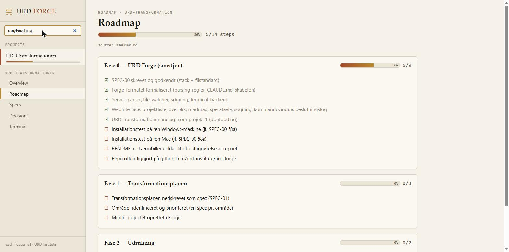
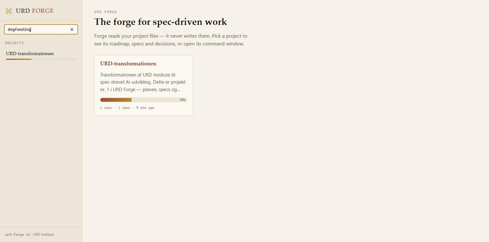
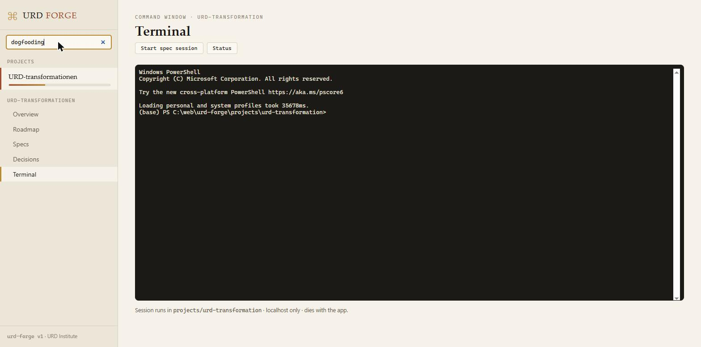

# URD Forge

**The open web interface for spec-driven AI development.**

Spec-driven conventions already exist — Spec Kit, Kiro, OpenSpec. What's
missing is the layer that makes the generated files navigable, visual and
searchable. Forge is that layer: **the reader, not another standard.** It
reads your project files, renders roadmap progress, a spec board, a decision
log and a concept timeline — and gives every project a command window for
Claude Code. The files are the database; Forge never writes to them.

Developed by [URD Institute](https://urdinstitute.org).



<details>
<summary>More screenshots</summary>




</details>

## Requirements

- **Node.js ≥ 20 (LTS)** — npm included ([nodejs.org](https://nodejs.org))
- **Git** — on Windows: [Git for Windows](https://gitforwindows.org) (required by Claude Code, which uses Git Bash)
- **A browser** — the UI runs on localhost
- **Claude Code** (optional, for the command window): `npm install -g @anthropic-ai/claude-code` + an Anthropic subscription or API key
- Without Claude Code, Forge still works as a full overview — the command window is simply an ordinary shell

## Install & run

```bash
git clone https://github.com/urd-institute/urd-forge.git
cd urd-forge
npm install
npm run forge
```

Open **http://localhost:4400**. Forge binds to localhost only.

## Your projects

Every folder under `projects/` is a project. Forge understands the
**Forge format**:

```
projects/<slug>/
├── README.md        # orientation — shown as the project front page
├── CLAUDE.md        # AI instructions (template in templates/CLAUDE.md)
├── CONCEPT.md       # canonical concept + "## Changelog" section → timeline
├── ROADMAP.md       # "## Fase N — name" phases, "- [ ]" steps → progress
├── DOCS.md          # living docs; "### ADR-…" headings → decision log
├── DESIGN.md        # optional: design tokens and components
├── specs/           # SPEC-xx-<slug>.md with YAML frontmatter → spec board
└── .forge/          # Forge's generated cache — never hand-edited
```

Spec frontmatter (Danish and English keys both accepted):

```yaml
---
id: SPEC-01
titel: My area          # or: title
status: draft           # draft | approved | in-progress | done | superseded
afhaenger_af: [SPEC-00] # or: depends_on
blokkerer: []           # or: blocks
topics: [auth, ui]      # optional: filter chips on the spec board
---
```

Copy `templates/CLAUDE.md` into new projects so AI sessions maintain the
structure automatically, and `templates/commands/forge.md` into
`.claude/commands/` to get the `/forge <description>` command, which drafts a
new spec in a running Claude Code session (projects created from the UI get
both). Parsing is tolerant: files that deviate are shown as
"could not be parsed" instead of breaking the UI.

## Screens

1. **Project list** — all projects with overall progress
2. **Project overview** — README, progress, recent activity, open specs;
   pin the project to the top of the list, export it as a zip, or archive it
3. **Roadmap** — phases with progress bars; every step links to its source file
4. **Spec board** — specs by status with dependencies; click for rendered markdown
5. **Search** — free text across all files in all projects
6. **Terminal panel** — docked at the bottom of every screen, with several
   tabs per project (Claude Code in one, a dev server in another), each a
   shell started in the project folder (xterm.js + node-pty); preset menus
   via `forge.config.yaml`
7. **Decision log** — the ADR list from DOCS.md, newest first
8. **Agents** — file-defined agents (`agents/*.md`; Security, Docs and Spec
   Drift ship as standard) run manually or on a schedule as Claude Code
   sessions in the terminal panel, and their suggestions are reviewed here:
   approve (the agent carries it out), draft a spec, decline or archive
9. **New project** — scaffold a project from a description (Claude Code drafts
   the documents), or import a project zip exported from another Forge
   installation

## Configuration

Copy `forge.config.example.yaml` to `forge.config.yaml` to configure port,
projects directory and terminal presets (grouped by topic, per project).
Everything has defaults; without the file Forge runs on port 4400 with a
built-in preset set. Your local `forge.config.yaml` is gitignored, so updates
never touch it.

## Security

Localhost binding only. No command execution via the HTTP API — the terminal
runs over a dedicated WebSocket, and preset commands are validated against the
server-side configuration. Agent runs are built server-side from the agent
files (the browser only names an agent), and headless runs get Claude Code
permission rules that allow writes under `agents/suggestions/` only. Sessions die with the app. A hosted edition needs
its own security spec (v2).

## License

[Apache-2.0](LICENSE) © URD Institute. The name **URD FORGE** and the URD
Institute marks are reserved — see [TRADEMARKS.md](TRADEMARKS.md).
